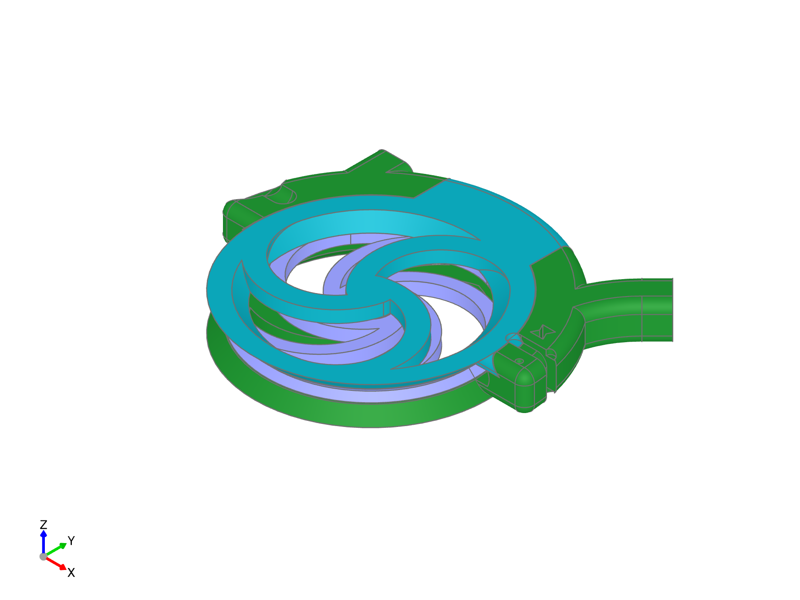

# Filament Bracket Assembly
<!---
..
    fender-bender readthedocs documentation

    by:   x0pherl
    date: September 25th 2024

    desc: This is the documentation for the fender-bender filament buffering solution on readthedocs

    license:

        Copyright 2024 x0pherl

        Permission is hereby granted, free of charge, to any person obtaining a copy of this software and associated documentation files (the “Software”), to deal in the Software without restriction, including without limitation the rights to use, copy, modify, merge, publish, distribute, sublicense, and/or sell copies of the Software, and to permit persons to whom the Software is furnished to do so, subject to the following conditions:

        The above copyright notice and this permission notice shall be included in all copies or substantial portions of the Software.

        THE SOFTWARE IS PROVIDED “AS IS”, WITHOUT WARRANTY OF ANY KIND, EXPRESS OR IMPLIED, INCLUDING BUT NOT LIMITED TO THE WARRANTIES OF MERCHANTABILITY, FITNESS FOR A PARTICULAR PURPOSE AND NONINFRINGEMENT. IN NO EVENT SHALL THE AUTHORS OR COPYRIGHT HOLDERS BE LIABLE FOR ANY CLAIM, DAMAGES OR OTHER LIABILITY, WHETHER IN AN ACTION OF CONTRACT, TORT OR OTHERWISE, ARISING FROM, OUT OF OR IN CONNECTION WITH THE SOFTWARE OR THE USE OR OTHER DEALINGS IN THE SOFTWARE.

-->

The "Filament Bracket" is the component responsible for ensuring that the filament smoothly moves
through the system when feeding the extruder, and is redirected to the buffer when retracting.
The system requires one filament bracket for each filament you need to buffer (on the Prusa MMU3, you'll need 5 filament brackets).

Each filament brack is assembled from:

 - bottom bracket
 - top bracket
 - filament wheel
 - bearing (must be purchased)
 - 2x connectors (must be purchased) required for some configurations

## Add connectors (for alternate components)

If you are using a part with PTFE connectors, they can be installed at any point, but putting them in place now makes sense.

## Add filament wheel and bearing to bottom bracket

{ align=left loading=lazy}

Start by placing the bearing on the bottom bracket stud, then press the wheel onto the bearing.
The wheel should spin freely when properly mounted, but don't worry too much if it is rubbing
a bit against the bottom at this point; it can be aligned when assembly is complete.

Note that if you have your tubes cut to the correct length, you may want to install them,
as they can be easier to insert at this point.

## Slide the top bracket into place

{ align=left loading=lazy}

The top bracket is designed to slide into the bottom bracket from the wheel side. The bearing
stud on the top bracket requires a bit of bending to assemble this.

Angle the top bracket into place so that the top extension is aligned with the bottom bracket
and drop it into place.

While pulling slightly up on the center of the wheel axle to bend the top bracket, slide it into place.
There should be plenty of give in the plastic to allow this, but be careful that the top extension is
properly aligned with the bottom bracket as you side it into place.

## Check alignment.

{ align=left loading=lazy}

The bracket should now be assembled. Double check to make sure the top axle stud is pressed fully down into the bearing.
The wheel should spin freely; the placement between the top and bottom bracket can be adjusted to ensure that the wheel is not rubbing against either bracket.