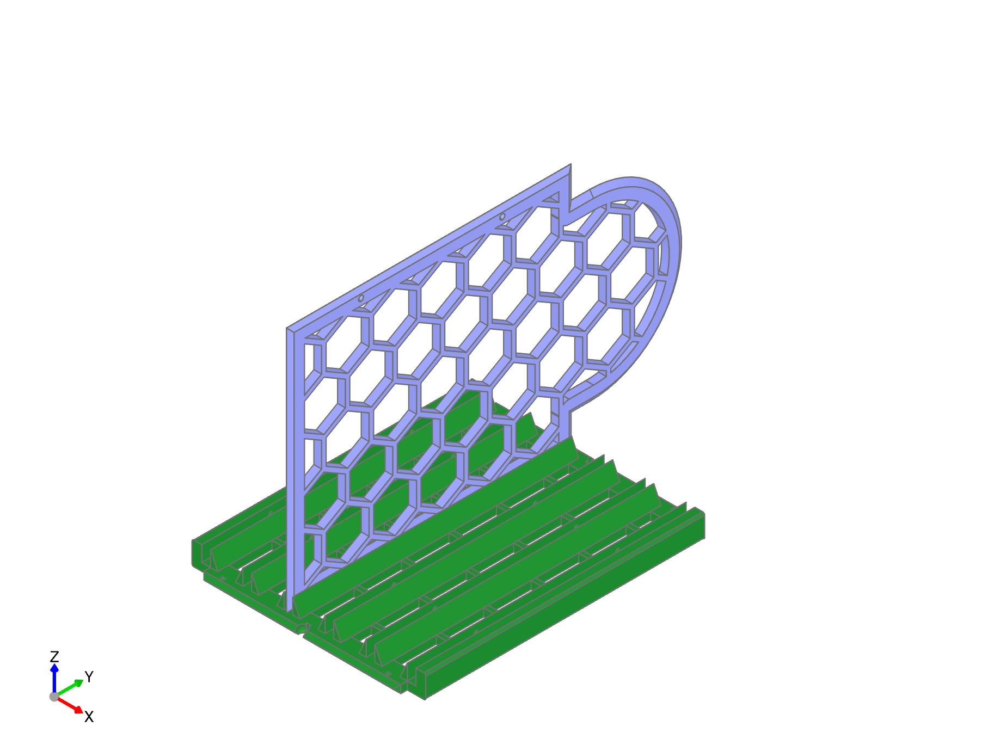
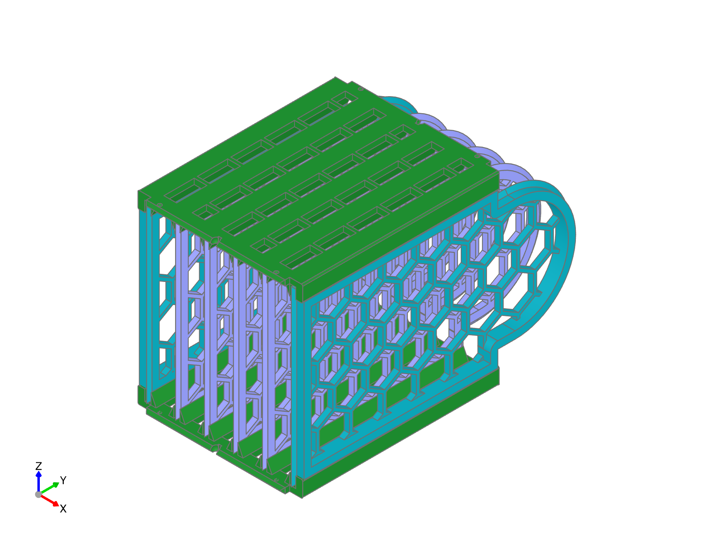

# Wall Assembly
<!---
..
    fender-bender readthedocs documentation

    by:   x0pherl
    date: September 25th 2024

    desc: This is the documentation for the fender-bender filament buffering solution on readthedocs

    license:

        Copyright 2024 x0pherl

        Permission is hereby granted, free of charge, to any person obtaining a copy of this software and associated documentation files (the “Software”), to deal in the Software without restriction, including without limitation the rights to use, copy, modify, merge, publish, distribute, sublicense, and/or sell copies of the Software, and to permit persons to whom the Software is furnished to do so, subject to the following conditions:

        The above copyright notice and this permission notice shall be included in all copies or substantial portions of the Software.

        THE SOFTWARE IS PROVIDED “AS IS”, WITHOUT WARRANTY OF ANY KIND, EXPRESS OR IMPLIED, INCLUDING BUT NOT LIMITED TO THE WARRANTIES OF MERCHANTABILITY, FITNESS FOR A PARTICULAR PURPOSE AND NONINFRINGEMENT. IN NO EVENT SHALL THE AUTHORS OR COPYRIGHT HOLDERS BE LIABLE FOR ANY CLAIM, DAMAGES OR OTHER LIABILITY, WHETHER IN AN ACTION OF CONTRACT, TORT OR OTHERWISE, ARISING FROM, OUT OF OR IN CONNECTION WITH THE SOFTWARE OR THE USE OR OTHER DEALINGS IN THE SOFTWARE.

-->

You'll need to build two complete wall assemblies for each filament bracket. The walls form the sides of each buffering chamber.

Each assembly consists of two guide walls to hold in the side walls, two reinforced side walls for the outside of the assebly, and enough side walls to fill the internal slots (there will be one less intneral wall than there all overall chambers)

While you can glue these parts together if you prefer, the parts are designed to snap together and hold in place without glue. Furthermore, the sidewalls inserted in this step are not load bearing; other steps may benefit more from gluing and will be noted.

## Insert internal side walls

{ align=left loading=lazy}

Begin laying one of the guide walls on a flat surface. Insert the internal walls into the guide slots of a single guide wall until they snap into place. There is no "top" or "bottom" of the guide walls, but the side walls should fit snap into the fittings on the guide slots. The side walls should slide in easily, but may require some force to fully seat. It can be helpful to start from the inside and work your way out.

## Insert external reinforced side walls

{ align=left loading=lazy}

Align the external walls so the reinforcement is facing outward then snap the parts into place as with the internal walls.

## Apply second guide wall

{ align=left loading=lazy}

Place the second guide wall on top of the assembly, taking care to insert each wall into the correct slot on the guide wall.

Starting with one reinforced side wall, press the guide wall down until the walls snap into place. Then work your way towards the other reinforced side wall, pressing each wall tightly into place.

When complete, take a moment to inspect the walls to ensure that they are all fully seated and that the assembly is square.

# Frame Assembly and Installation

Now that you've completed the wall assemblies and filament brackets, it's time to put it all together. This section will guide you through the assembly and installation of the frame.

## Inspect and Clean Frames

The fitting of the wall assemblies into the frame pulls the whole filament buffer together. Because they need to be printed with supports, it is helpful to take
a moment to inspect the frame and clean up any rough edges or supports that may be left over from the print. Pay careful attention to the slots on the arches where
the walls will be inserted, as any rough edges or supports can make assembly difficult.

## The Bottom Frame

Carefully align one of the wall assembly's curved sides with the arch of the bottom frame. Insert until the guide walls are aligned with the frame slots. We recommend
adding glue to the guide wall slots, but as this connection will only bear the weight of the bottom frame, it is not required; especially if you plan on screwing
the frame to a wall, as the bottom screw will hold the frame in place.

Press the wall assembly firmly into place; you should feel the guide walls snap into place.

## Add the Connector Frame to the bottom assembly

The connector frame, given it's straight edges, should be easier to insert, but still merits a quick inspection; especially if you've printed with supports.
Align the connector frame above the flat edges of the bottom wall assembly and press into place. The connector frame should snap into place.

Glue is recommended, but not required.

## Top Wall Assembly

The top wall assembly can now be placed in the connector frame. Align the top wall assebly with the connector frame and press into place. The top wall assembly should snap into place.

Glue is recommended, but not strictly required.

## Top Frame Assembly

The Top Frame can now be added, completing the assembly of the frame. Carefully align one of the wall assembly's curved sides with the arch of the bottom frame.
Insert until the guide walls are aligned with the frame slots, then click firmly into place.

Because the top frame will bear the weight of the filament brackets, and may shift as you insert and remove filament brackets, we strongly recommend adding glue to the slots where the guide walls will be inserted.