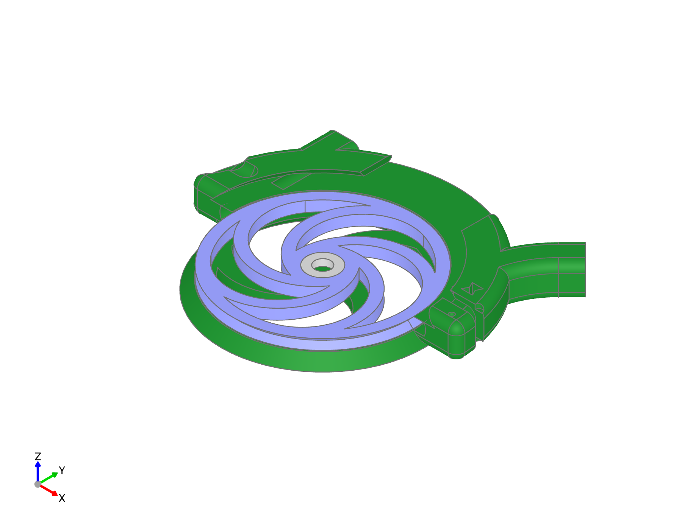
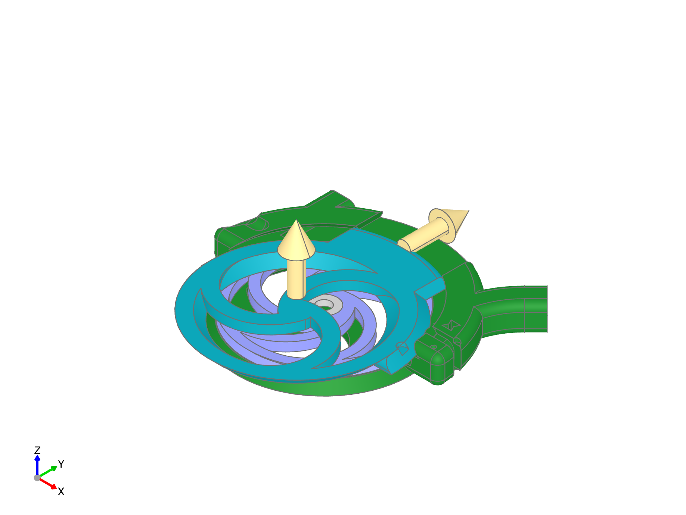

.. image:: ./assets/logo.svg
  :align: right
  :alt: fender-bender logo

########
Filament Bracket
########

The "Filament Bracket" is the component responsible for ensuring that the filament smoothly moves
through the system when feeding the extruder, and is redirected to the buffer when retracting.
The system requires one filament bracket for each filament you need to buffer (on the Prusa MMU3, you'll need 5 filament brackets).

Each filament brack is assembled from:
* bottom bracket
* top bracket
* filament wheel
* bearing (must be purchased)
* 2x connectors (must be purchased) required for some configurations

########
Assembly
########

.. _install-connectors:

Add connectors (for alternate components)
========

If you are using a part with PTFE connectors, they can be installed at any point, but putting them in place now makes sense.

.. _wheel-bearing:

Add filament wheel and bearing to bottom bracket
========

Start by placing the bearing on the bottom bracket stud, then press the wheel onto the bearing.
The wheel should spin freely when properly mounted, but don't worry too much if it is rubbing
a bit against the bottom at this point; it can be aligned when assembly is complete.

Note that if you have your tubes cut to the correct length, you may want to install them,
as they can be easier to insert at this point.

.. _slide-top:

Slide the top bracket into place
========

The top bracket is designed to slide into the bottom bracket from the wheel side. The bearing
stud on the top bracket requires a bit of bending to assemble this.

Angle the top bracket into place so that the top extension is aligned with the bottom bracket
and drop it into place.

While pulling slightly up on the center of the wheel axle to bend the top bracket, slide it into place.
There should be plenty of give in the plastic to allow this, but be careful that the top extension is
properly aligned with the bottom bracket as you side it into place.

.. _check-fit:

Check alignment.
========
.. image:: ./assets/step-003-bracket-complete.png
  :align: left
  :alt: step three showing the fully assembled bottom bracket

The bracket should now be assembled. Double check to make sure the top axle stud is pressed fully down into the bearing.
The wheel should spin freely; the placement between the top and bottom bracket can be adjusted to ensure that the wheel is
not rubbing against either bracket.
