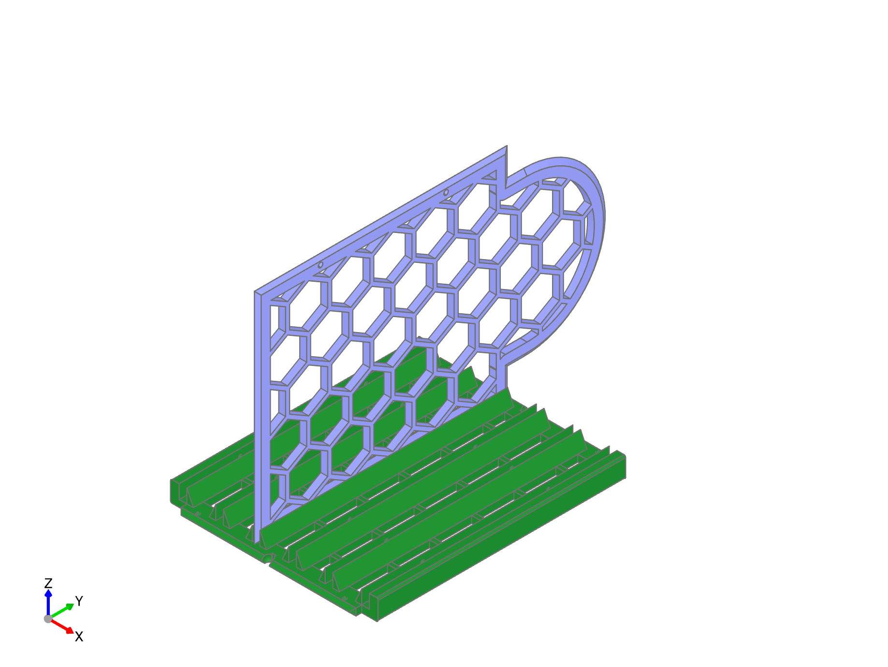
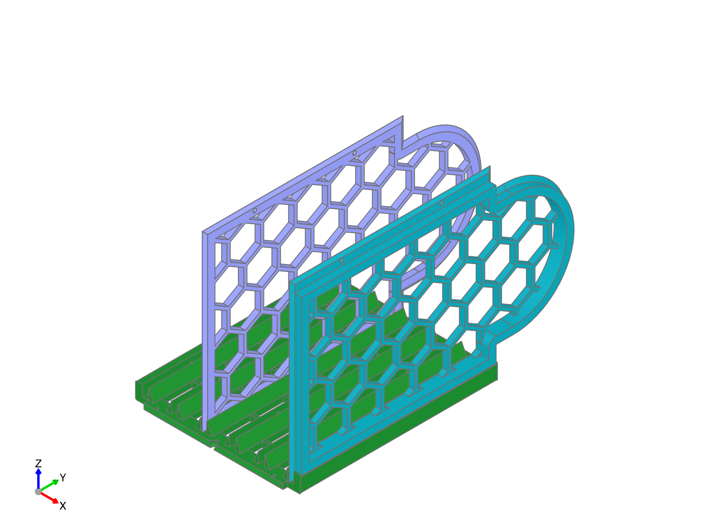
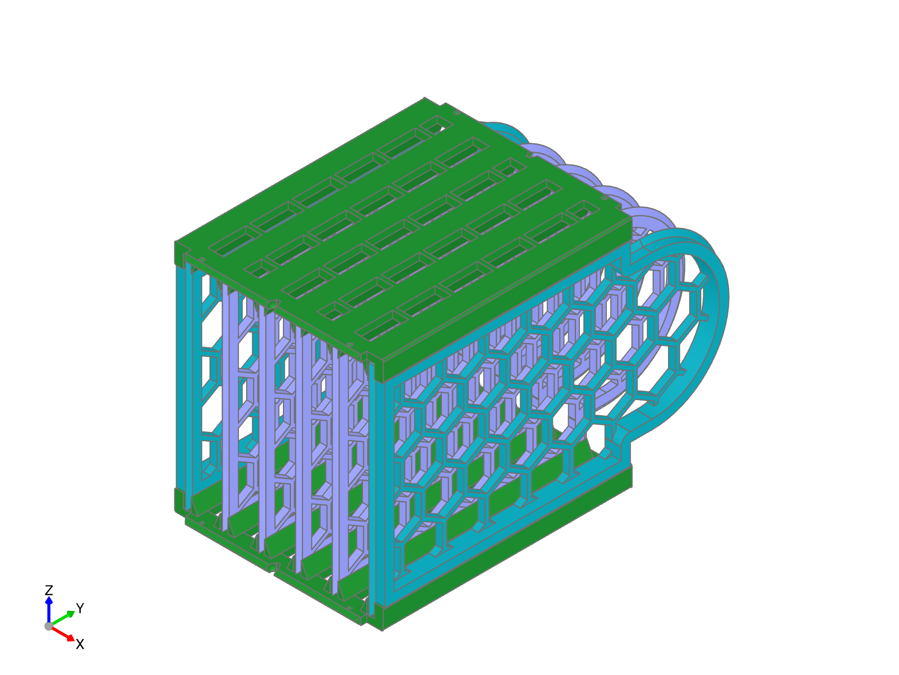

.. image:: ./assets/logo.svg
  :align: right
  :alt: fender-bender logo

########
Walls
########

You'll need to build two complete wall assemblies for each filament bracket. The walls form the sides of each buffering chamber.

Each assembly consists of two guide walls to hold in the side walls, two reinforced side walls for the outside of the assebly, and enough side walls to fill the internal slots (there will be one less intneral wall than there all overall chambers)

While you can glue these parts together if you prefer, the parts are designed to snap together and hold in place without glue. Furthermore, the sidewalls inserted in this step are not load bearing; other steps may benefit more from gluing and will be noted.

########
Assembly
########

.. _insert-internal-walls:

Insert internal side walls
========

Begin laying one of the guide walls on a flat surface. Insert the internal walls into the guide slots of a single guide wall until they snap into place. There is no "top" or "bottom" of the guide walls, but the side walls should fit snap into the fittings on the guide slots. The side walls should slide in easily, but may require some force to fully seat. It can be helpful to start from the inside and work your way out.

.. _insert-external-walls:

Insert external reinforced side walls
========

Align the external walls so the reinforcement is facing outward then snap the parts into place as with the internal walls.

.. _apply-second-guide-wall:

Apply second guide wall
========

Place the second guide wall on top of the assembly, taking care to insert each wall into the correct slot on the guide wall.

Starting with one reinforced side wall, press the guide wall down until the walls snap into place. Then work your way towards the other reinforced side wall, pressing each wall tightly into place.

When complete, take a moment to inspect the walls to ensure that they are all fully seated and that the assembly is square.
